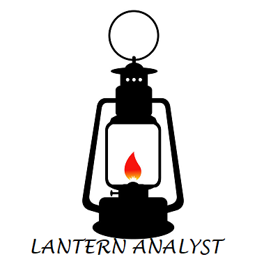

# This file repository contain notebooks on data analysis  by the Lantern Analyst (me) 

## AIM:

After going through the files, you should be able to gauge my analytical experience and possibly get me an interview invite <smiles>

*   I can create data from simple everyday activities performed by any matter
*   I can get data from any source or database, SQL or NOSQL

  

    

# Plotting Charts

## Energy Delivered Among Distribution Companies in Nigeria (2014-2021)

This analysis relies heavily on **Pandas** and **Numpy** Libraries.
Dataset used is got from **NERC** (Nigerian Electricity Regulatory Commission) but downloaded onto a *csv* format. 
 There are a total of 11 distribution companies in Nigeria. And data represented here shows energy consumed/delivered in Gigawatt-hours (GWh)
  *Note that original data would be wrangled in order to give a more desirable analysis* 
